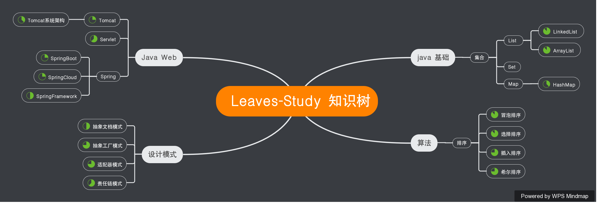

# 叶子的学习规划

# Java基础

1.  [ArrayList  学习笔记(jdk1.8)---待完善](study notes/java basics/list/ArrayListStudyNotes.md)  
2.  [LinkedList 学习笔记(jdk1.8)---待完善](study notes/java basics/list/LinkedListStudyNotes.md)  
3.  [HashMap 学习笔记 (jdk 1.8)---学习中](study notes/java basics/map/HashMapStudyNotes.md)

### 坚持就是胜利

