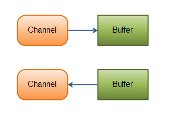

# Channel

Java NIO 的通道(Channel) 类似流，但是有些不同:

* 既可以从通道中读取数据，又可以写数据到通道。但流的读写通常都是单向的。
* 通道可以异步地读写。
* 通道中的数据总是要先读到一个 Buffer ,或者总是要从一个 Buffer 写入。

从通道读取数据到缓冲区，从缓冲区写入数据到通道.如下图所示:

Channel 重要的实现如下:

- FileChannel

  FileChannel 从文件中读写数据。

- DatagramChannel

  DatagramChannel 能通过UDP读写网络中的数据。

- SocketChannel

  SocketChannel 能通过TCP读写网络中的数据。

- ServerSocketChannel

  ServerSocketChannel 可以监听新进来的TCP连接，像Web服务器那样。对每一个新进来的连接都会创建一个 SocketChannel。

# 参考资料

* [Java NIO系列教程（二） Channel](http://ifeve.com/channels/#comments)
* [Java NIO Channel](http://tutorials.jenkov.com/java-nio/channels.html)

