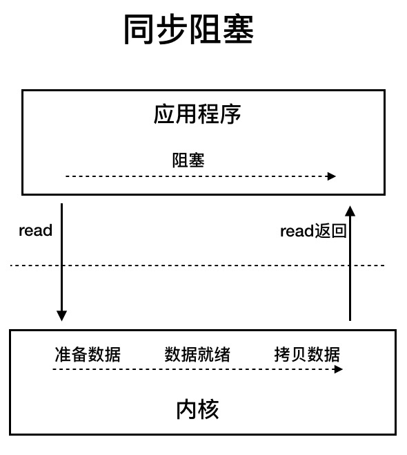

# JAVA I/O 

[TOC]

## 什么是 I/O ?

I/O 就是计算机内存与外部设备之间拷贝数据的过程。

## 同步/异步 阻塞/非阻塞 的概念

* 阻塞

  用户线程去系统内核从网络读取数据，阻塞住等待数据到来。

* 非阻塞

  用户线程去系统内核从网络读取数据，数据没来时立刻返回读取失败，然后用户线程不断轮询 读取数据。

* 同步

  用户线程去系统内核从网络读取数据时，内核同步返回数据。

* 异步

  用户线程去系统内核从网络读取数据时，用户线程读取方法立刻返回。内核异步传递数据给用户线程。

## I/O 模型

### 同步阻塞 I/O

用户线程发起 read 调用后就阻塞了，内核等待网卡数据到来，把数据从网卡拷贝到内核空间，接着把数据拷贝到用户空间,然后用户线程继续执行。。

### 同步非阻塞 I/O

### I/O 多路复用

### 异步  I/O

### 信号驱动 I/O

# 参考资料

* [深入拆解 Tomcat & Jetty](https://time.geekbang.org/column/article/100307)
* [百度、腾讯热门面试题：聊聊Unix与Java的IO模型？（含详细解析）](https://juejin.im/post/5cc16477e51d456e7f0ba5b6)