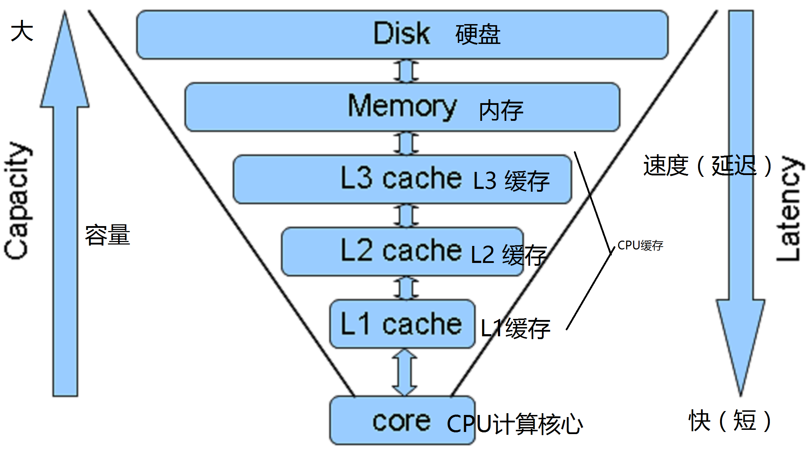
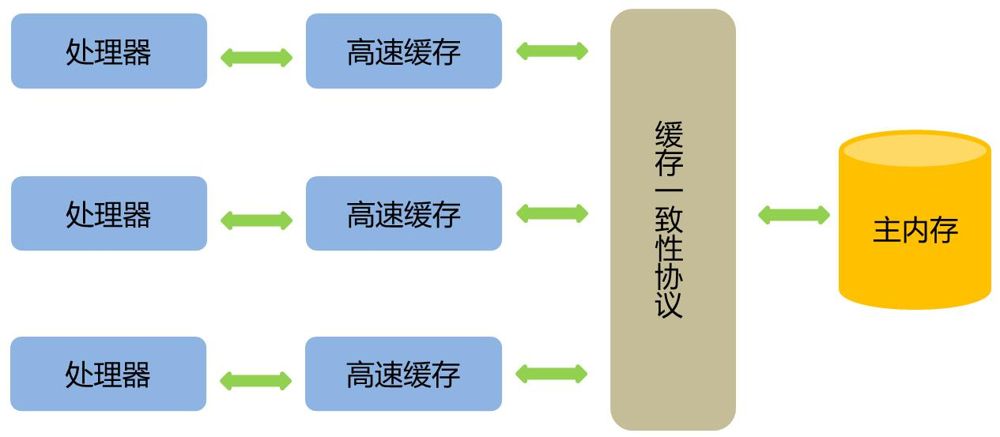

# Java 并发机制的底层实现原理

[TOC]

# volatile

**volatile 是轻量级的synchronized,它在多处理器开发中保证了共享变量的 可见性 。**

```
 可见性 : 当一个线程修改一个共享变量时，另外一个线程能读到这个修改的值。
```

volatile 比 synchronized 的使用和执行成本更低，因为它不会引起线程上下文的切换和调度。

### volatile 的定义与实现原理

**如果一个字段被声明成 volatile ，Java 线程内存模型确保所有线程看到的这个变量的值是一致的。**


volatile 关键字修饰的共享变量进行 写操作的时候 JVM 会向处理器发送一条 Lock 前缀的指令，Lock指令在多核处理器下会引发两件事情：

1. 将当前处理器缓存行的数据写回到系统内存。
2. 这个写回内存的操作会使在其他 CPU 里缓存了该内存地址的数据无效。


为了提高速度，处理器不直接与内存进行通信，而是先将系统内存的数据读到内部缓存(L1,L2 或其他)后再进行操作，但操作完不知道何时会写到内存。

CPU多级缓存如下图所示（[图来源于网络](http://www.woshipm.com/pd/425699.html?utm_source=gold_browser_extension)）:



如果对声明了 volatile 的变量进行写操作，JVM 就会向处理器发送一条 Lock 前缀的指令，将这个变量所在缓存行的数据写回到系统内存。但是，就算写回到系统内存，如果其他处理器缓存的值还是旧值，再执行计算操作就会有问题。

**所以在多处理器下，为了保证各个处理器的缓存是一致的，就会实现缓存一致性协议**，每个处理器通过嗅探在总线上传播的数据来检查自己缓存的值是不是过期了，当处理器发现自己缓存对应得内存地址被修改，就会将当前处理器的缓存行设置成无效状态，当处理器对这个数据进行修改操作的时候，会重新从系统内存中把数据读到处理器缓存里。

缓存一致性协议图([图来源于网络](https://blog.csdn.net/n9nzjx57bf/article/details/71638893))：

