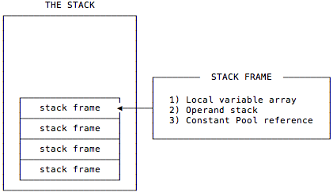

# JVM 

JAVA 虚拟机学习笔记

# JAVA 内存区域

Java虚拟机在运行程序期间会划分运行时数据区域，有些数据区域随着jvm的启动而创建，退出而销毁。有些数据区域随着线程的启动和结束而创建和销毁。

### PC(Program Counter) Register 程序计数器

程序计数器是一块较小的内存空间，可以看作是当前线程所执行的字节码的行号指示器。

每条线程都需要有一个独立的程序计数器，各线程之间计数器互不影响，独立存储，这类内存区域为“线程私有”的内存。

在某一时刻，某个java线程正在执行的某个方法，如果这个方法是native方法，计数器的值为空(undefined),如果这个方法不是native方法，计数器的值为正在执行的虚拟机字节码指令的地址。

**程序计数器主要有两个作用：**

1. 字节码解释器通过改变程序计数器来依次读取指令，从而实现代码的流程控制，如：顺序执行、选择、循环、异常处理。
2. 在多线程的情况下，程序计数器用于记录当前线程执行的位置，从而当线程被切换回来的时候能够知道该线程上次运行到哪儿了。

**注意：程序计数器是唯一一个不会出现 OutOfMemoryError 的内存区域，它的生命周期随着线程的创建而创建，随着线程的结束而死亡。**

### JVM Stacks  （ Java 虚拟机栈）

与程序计数器一样，Java 虚拟机栈也是线程私有的，它的生命周期和线程相同，描述的是 Java 方法执行的内存模型，每次方法调用的数据都是通过栈传递的。

**Java 内存可以粗糙的区分为堆内存（Heap）和栈内存 (Stack),其中栈就是现在说的虚拟机栈，或者说是虚拟机栈中局部变量表部分。** （实际上，Java 虚拟机栈是由一个个栈帧组成，而每个栈帧中都拥有：局部变量表、操作数栈、动态链接、方法出口信息。）

**局部变量表主要存放了编译器可知的各种数据类型**（boolean、byte、char、short、int、float、long、double）、**对象引用**（reference 类型，它不同于对象本身，可能是一个指向对象起始地址的引用指针，也可能是指向一个代表对象的句柄或其他与此对象相关的位置）。

**Java 虚拟机栈会出现两种异常：StackOverFlowError 和 OutOfMemoryError。**

- **StackOverFlowError：** 若 Java 虚拟机栈的内存大小不允许动态扩展，那么当线程请求栈的深度超过当前 Java 虚拟机栈的最大深度的时候，就抛出 StackOverFlowError 异常。
- **OutOfMemoryError：** 若 Java 虚拟机栈的内存大小允许动态扩展，且当线程请求栈时内存用完了，无法再动态扩展了，此时抛出 OutOfMemoryError 异常。

Java 虚拟机栈也是线程私有的，每个线程都有各自的 Java 虚拟机栈，而且随着线程的创建而创建，随着线程的死亡而死亡。

##### 方法调用时,栈 怎么工作的？

如上图所示，java 栈中保存了 栈帧，每一次方法调用都会有对呀的栈帧(Stack frame)被压入栈(Stack),每一个方法调用结束后，都会有一个栈帧被弹出。

### Native Method Stacks 本地方法栈 

本地方法栈与虚拟机栈作用类似，他们的区别不过是，虚拟机栈为Java方法服务，而本地方法栈为native方法服务，与虚拟机栈一样，本地方法被执行的时候，在本地方法栈也会创建一个栈帧，用于存放该本地方法的局部变量表、操作数栈、动态链接、出口信息。本地方法栈也会抛出**StackOverflowError**与**OutOfMemoryError** 异常。

# 参考资料

* 深入理解 Java 虚拟机

* [Java Guide Java内存区域](https://github.com/Snailclimb/JavaGuide/blob/master/docs/java/jvm/Java%E5%86%85%E5%AD%98%E5%8C%BA%E5%9F%9F.md)
* [JVM 内存结构之运行时数据区域](https://blog.csdn.net/weixin_39913200/article/details/81842843)